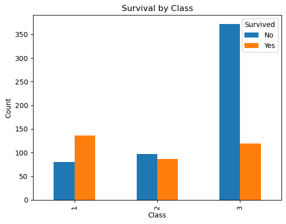
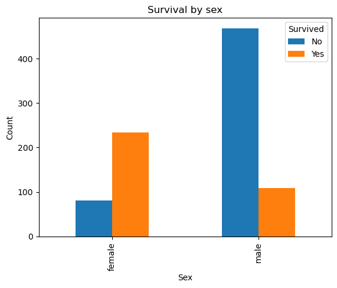
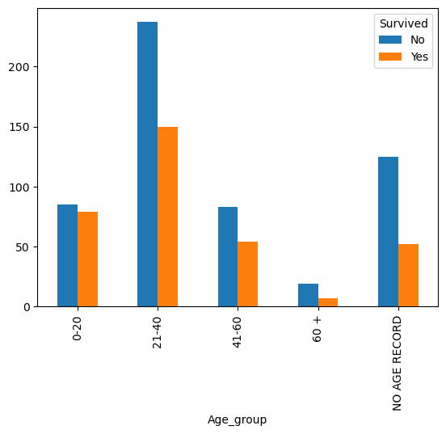

# Titanic Analysus 
for CPSC Assignment3 Part2, Langara College

This repository contains an analysis of the Titanic dataset, exploring the relationships between passenger class, gender, age, and survival rates. The dataset used in this analysis is based on the famous Titanic passenger list and includes information on passengers' demographics and their survival status.

## Hypotheses
In this analysis, we set out to answer three hypotheses:

### Hypothesis 1: Determining the Association Between Survival Rate and Passenger Class
### Hypothesis 2: Determining the Association Between Survival Rate and Gender
### Hypothesis 3: Determining the Association Between Survival Rate and Age

## Data Analysis and Results
To answer these hypotheses, we performed data analysis using Python and various data visualization techniques, including Matplotlib. Below are the key findings and conclusions from our analysis:

### Hypothesis 1: Association Between Survival Rate and Passenger Class
We found that passengers in the first class had a significantly higher survival rate compared to passengers in the lower classes. The results are visualized in the following bar chart:

### Hypothesis 2: Association Between Survival Rate and Gender
Our analysis showed that female passengers had a much higher survival rate compared to male passengers. The results are visualized in the following pie chart:

### Hypothesis 3: Association Between Survival Rate and Age
We analyzed the relationship between age and survival rate and found that children (under 18) had a higher survival rate compared to adults. The results are visualized in the following histogram:

## Conclusion
Based on our analysis, we can conclude the following:

Passenger class played a significant role in survival rates, with first-class passengers having the highest survival rate.
Gender also played a crucial role, with female passengers having a substantially higher chance of survival.
Age was associated with survival rates, as children had a higher survival rate compared to adults.
These findings are essential for understanding the dynamics of survival on the Titanic and the factors that influenced passengers' chances of survival.

For a more detailed analysis and to reproduce the results, please refer to the Jupyter Notebook and result file provided in this repository.

## How to Reproduce the Analysis
Clone this repository to your local machine.
Install the required Python libraries (Pandas, Matplotlib, etc.).
Open the Jupyter Notebook to see the analysis and generate the plots.
Feel free to explore the data and analysis further, or use it as a template for similar investigations. Enjoy your journey through the Titanic dataset!
